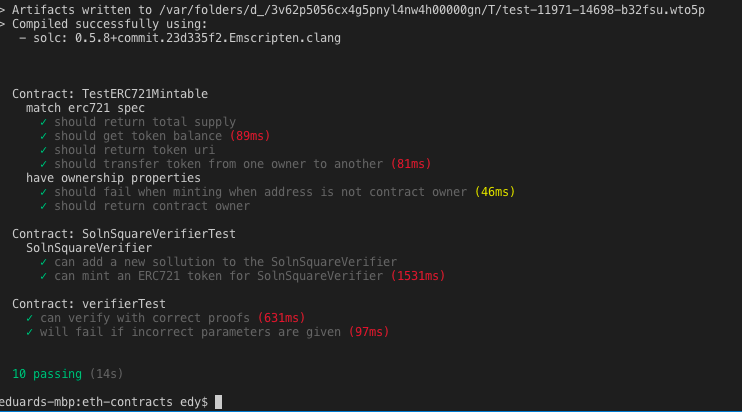
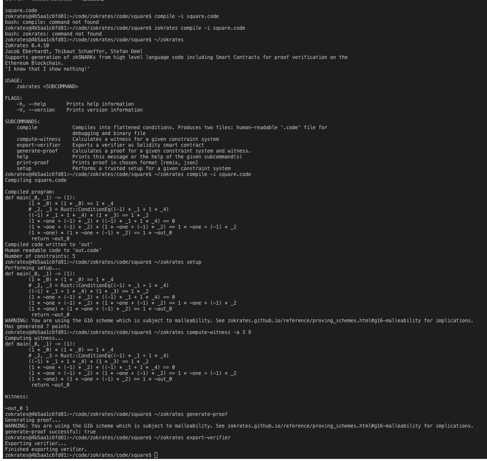

# Udacity Blockchain Capstone

## Decentralized Real Estate Marketplace project for Udacity nanodegree program
This repository contains Ethereum smart-contracts that are meant to be used together with an instance of Zokrates to create Non Fungible Tokens for the properties you own.

This repository is just a proof of concept that only covers the requirements of the Udacity nanodegree program.


# Getting Started
These instructions will get you a copy of the project up and running on your local machine for development and testing purposes.

## Prerequisites
Please make sure you've already installed ganache-cli, Truffle, Node.js, 
npm package manager, Docker and git.

#### Ganache Prerequisites
Ganache must be running on the local machine on port 8545. For ganache-cli you can use:
```
ganache-cli -a 50 -e 1000 -p 8545
```

## Installing

Clone this repository: `https://github.com/eandrasi/udacity_blockchain_capstone.git`\
```
git clone git@github.com:eandrasi/udacity_blockchain_capstone.git
```
cd into the folder\
Install using `npm install`\
Launch Ganache with the settings described above\
Launch the Zokrates Docker container `docker run -v <path to your project folder>:/home/zokrates/code -ti zokrates/zokrates:0.3.0 /bin/bash` \
In Zokrates's console compile the square.code `~/zokrates compile -i square.code`\
Then run the zokrates setup command `~/zokrates setup`\
Run the compute-witness command with a number and it's square`~/zokrates compute-witness -a 3 9`\
Ask Zokrates to generate the proof `~/zokrates generate-proof`\
Finally tell Zokrates to generate the smart-contract `~/zokrates export-verifier`\
Copy the generated `verifier.sol` to the `eth-contracts/contracts` folder \
cd into the eth-contracts folder `cd eth-contracts`
Compile all the smart-contracts: `truffle compile`\
Run all the tests `truffle test`\
All the tests should pass\
You should se something like this:


### Screenshot Zokrates



## Running the Dapp
Open another terminal and go to the app folder `cd app` \
Make sure your contracts are compiled and deployed to local Ganache \
Install the app by running `npm install` inside the app folder \
Run the Dapp `npm run start` \
Open a chrome incognito window \
Go to: http://localhost:3000/ \
You should see something like this:
## User interface 

The user interface only contains basic functions.
For easy testing only view the Dapp in an incognito window, or a browser that does not use Metamask. The web 3 should be injected by the framework.


### Contract Abi
After compiling the contracts, the contract Abi should be in the eth-contracts/build/contracts folder

# Authors
Eduard Andrasi

# Built With
+ Ethereum - Ethereum is a decentralized platform that runs smart contracts
+ IPFS - IPFS is the Distributed Web | A peer-to-peer hypermedia protocol to make the web faster, safer, and more open.
+ Truffle Framework - Truffle is the most popular development framework for Ethereum with a mission to make your life a whole lot easier.
+ openzeppelin-solidity
+ truffle-assertions
+ Solidity
+ Ganache-cli


# Project Resources

* [Remix - Solidity IDE](https://remix.ethereum.org/)
* [Visual Studio Code](https://code.visualstudio.com/)
* [Truffle Framework](https://truffleframework.com/)
* [Ganache - One Click Blockchain](https://truffleframework.com/ganache)
* [Open Zeppelin ](https://openzeppelin.org/)
* [Interactive zero knowledge 3-colorability demonstration](http://web.mit.edu/~ezyang/Public/graph/svg.html)
* [Docker](https://docs.docker.com/install/)
* [ZoKrates](https://github.com/Zokrates/ZoKrates)
