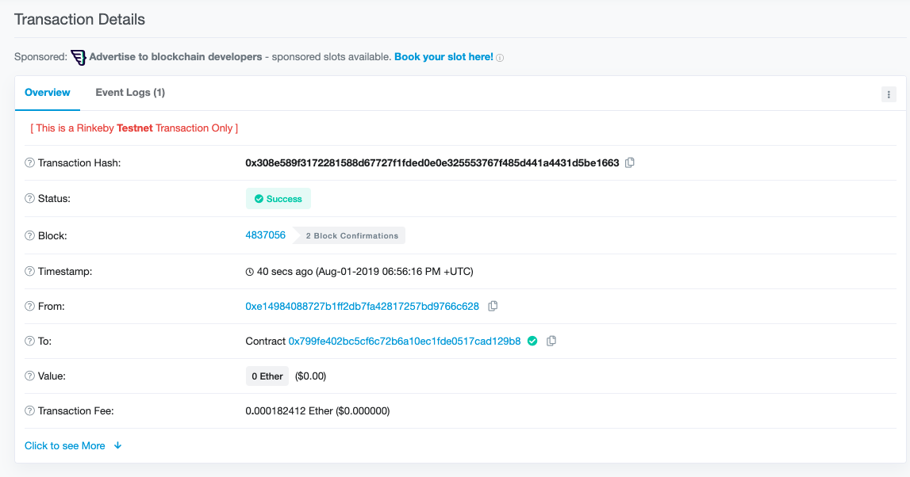
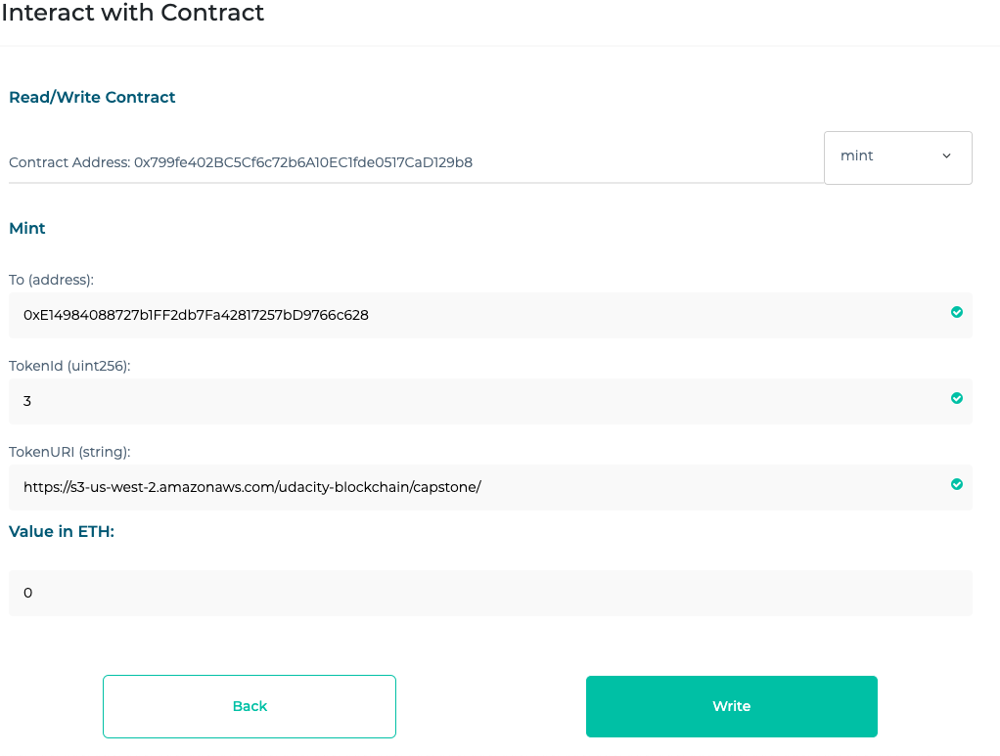
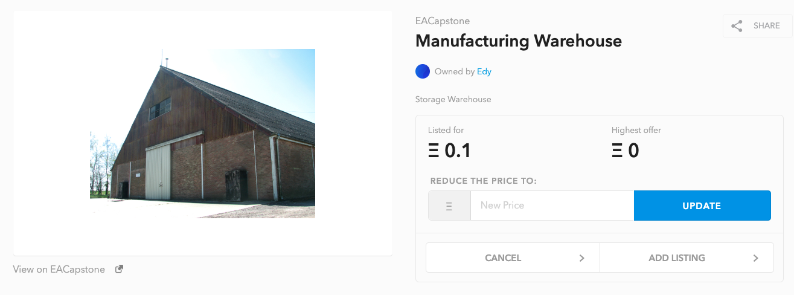
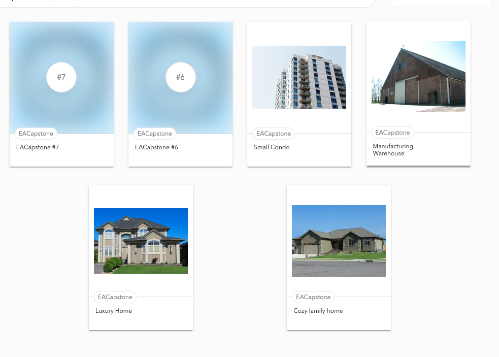
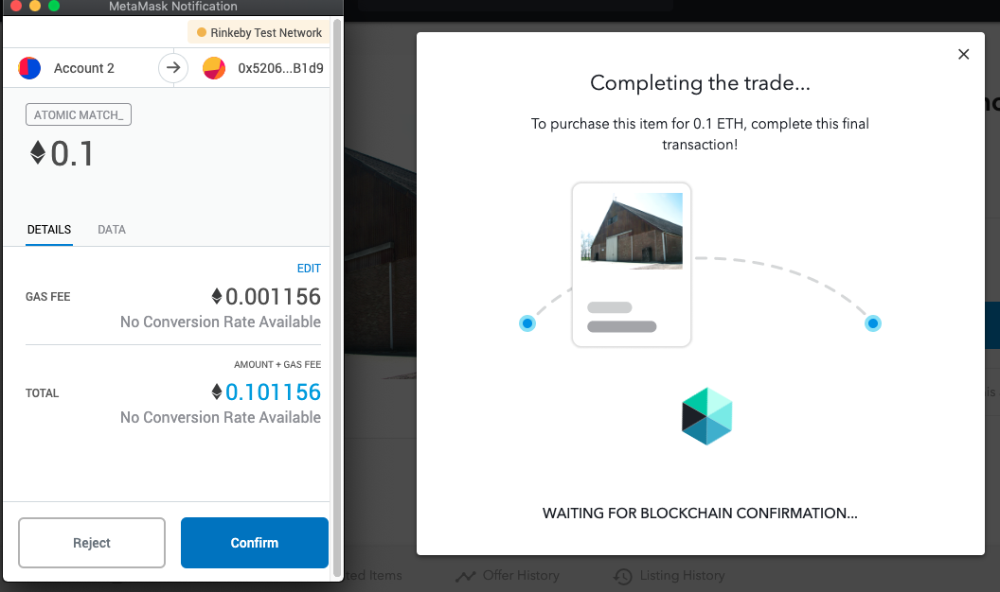

# Udacity Blockchain Capstone

## Decentralized Real Estate Marketplace project for Udacity nanodegree program
This repository contains Ethereum smart-contracts that are meant to be used together with an instance of Zokrates to create Non Fungible Tokens for the properties you own.

This repository is just a proof of concept that only covers the requirements of the Udacity nanodegree program.


# Getting Started
These instructions will get you a copy of the project up and running on your local machine for development and testing purposes.

## Prerequisites
Please make sure you've already installed ganache-cli, Truffle, Node.js, 
npm package manager, Docker and git.

#### Ganache Prerequisites
Ganache must be running on the local machine on port 8545. For ganache-cli you can use:
```
ganache-cli -a 50 -e 1000 -p 8545
```

## Installing

Clone this repository: `https://github.com/eandrasi/udacity_blockchain_capstone.git`\
```
git clone git@github.com:eandrasi/udacity_blockchain_capstone.git
```
cd into the folder\
Install using `npm install`\
Launch Ganache with the settings described above\
Launch the Zokrates Docker container `docker run -v <path to your project folder>:/home/zokrates/code -ti zokrates/zokrates:0.3.0 /bin/bash` \
In Zokrates's console compile the square.code `~/zokrates compile -i square.code`\
Then run the zokrates setup command `~/zokrates setup`\
Run the compute-witness command with a number and it's square`~/zokrates compute-witness -a 3 9`\
Ask Zokrates to generate the proof `~/zokrates generate-proof`\
Finally tell Zokrates to generate the smart-contract `~/zokrates export-verifier`\
Copy the generated `verifier.sol` to the `eth-contracts/contracts` folder \
cd into the eth-contracts folder `cd eth-contracts`
Compile all the smart-contracts: `truffle compile`\
Run all the tests `truffle test`\
All the tests should pass\
You should se something like this:


### Screenshot Zokrates


## Deploy on Rinkeby
To deploy on the Rinkeby network run `truffle migrate --network rinkeby --reset`

## Contract addresses on Rinkeby
verifier `0x3cbD72ffc0E14cF4BacC0d1e0E2D32198a0f185b`\
SolnSquareVerifier transaction hash `0xf373fe6892f3faec05bee9859b022c9010927d860443850f1915ca4a688f254b`\
SolnSquareVerifier contract `0x799fe402BC5Cf6c72b6A10EC1fde0517CaD129b8`
First mint transaction hash `0x2c77a10c81b3b4cb95d8baa8dc1e7003d722651e5bcd2da05fcbd8a1eee6da7b`
First list transaction `0x308e589f3172281588d67727f1fded0e0e325553767f485d441a4431d5be1663`

## OpenSea
Visit the page: `https://rinkeby.opensea.io/assets/0x799fe402BC5Cf6c72b6A10EC1fde0517CaD129b8`
TokenUri: `https://s3-us-west-2.amazonaws.com/udacity-blockchain/capstone/`

## OpenSea Token Listing/Selling






# Authors
Eduard Andrasi

# Built With
+ Ethereum - Ethereum is a decentralized platform that runs smart contracts
+ IPFS - IPFS is the Distributed Web | A peer-to-peer hypermedia protocol to make the web faster, safer, and more open.
+ Truffle Framework - Truffle is the most popular development framework for Ethereum with a mission to make your life a whole lot easier.
+ openzeppelin-solidity
+ truffle-assertions
+ Solidity
+ Ganache-cli


# Project Resources

* [Remix - Solidity IDE](https://remix.ethereum.org/)
* [Visual Studio Code](https://code.visualstudio.com/)
* [Truffle Framework](https://truffleframework.com/)
* [Ganache - One Click Blockchain](https://truffleframework.com/ganache)
* [Open Zeppelin ](https://openzeppelin.org/)
* [Interactive zero knowledge 3-colorability demonstration](http://web.mit.edu/~ezyang/Public/graph/svg.html)
* [Docker](https://docs.docker.com/install/)
* [ZoKrates](https://github.com/Zokrates/ZoKrates)


### Contract Abi
ABI
`
[
    {
      "constant": true,
      "inputs": [
        {
          "name": "interfaceId",
          "type": "bytes4"
        }
      ],
      "name": "supportsInterface",
      "outputs": [
        {
          "name": "",
          "type": "bool"
        }
      ],
      "payable": false,
      "stateMutability": "view",
      "type": "function"
    },
    {
      "constant": false,
      "inputs": [],
      "name": "name",
      "outputs": [
        {
          "name": "name",
          "type": "string"
        }
      ],
      "payable": false,
      "stateMutability": "nonpayable",
      "type": "function"
    },
    {
      "constant": true,
      "inputs": [
        {
          "name": "tokenId",
          "type": "uint256"
        }
      ],
      "name": "getApproved",
      "outputs": [
        {
          "name": "",
          "type": "address"
        }
      ],
      "payable": false,
      "stateMutability": "view",
      "type": "function"
    },
    {
      "constant": false,
      "inputs": [
        {
          "name": "to",
          "type": "address"
        },
        {
          "name": "tokenId",
          "type": "uint256"
        }
      ],
      "name": "approve",
      "outputs": [],
      "payable": false,
      "stateMutability": "nonpayable",
      "type": "function"
    },
    {
      "constant": false,
      "inputs": [
        {
          "name": "_isPaused",
          "type": "bool"
        }
      ],
      "name": "setPaused",
      "outputs": [],
      "payable": false,
      "stateMutability": "nonpayable",
      "type": "function"
    },
    {
      "constant": true,
      "inputs": [],
      "name": "totalSupply",
      "outputs": [
        {
          "name": "",
          "type": "uint256"
        }
      ],
      "payable": false,
      "stateMutability": "view",
      "type": "function"
    },
    {
      "constant": false,
      "inputs": [
        {
          "name": "from",
          "type": "address"
        },
        {
          "name": "to",
          "type": "address"
        },
        {
          "name": "tokenId",
          "type": "uint256"
        }
      ],
      "name": "transferFrom",
      "outputs": [],
      "payable": false,
      "stateMutability": "nonpayable",
      "type": "function"
    },
    {
      "constant": false,
      "inputs": [
        {
          "name": "_myid",
          "type": "bytes32"
        },
        {
          "name": "_result",
          "type": "string"
        }
      ],
      "name": "__callback",
      "outputs": [],
      "payable": false,
      "stateMutability": "nonpayable",
      "type": "function"
    },
    {
      "constant": true,
      "inputs": [
        {
          "name": "owner",
          "type": "address"
        },
        {
          "name": "index",
          "type": "uint256"
        }
      ],
      "name": "tokenOfOwnerByIndex",
      "outputs": [
        {
          "name": "",
          "type": "uint256"
        }
      ],
      "payable": false,
      "stateMutability": "view",
      "type": "function"
    },
    {
      "constant": false,
      "inputs": [
        {
          "name": "_myid",
          "type": "bytes32"
        },
        {
          "name": "_result",
          "type": "string"
        },
        {
          "name": "_proof",
          "type": "bytes"
        }
      ],
      "name": "__callback",
      "outputs": [],
      "payable": false,
      "stateMutability": "nonpayable",
      "type": "function"
    },
    {
      "constant": false,
      "inputs": [
        {
          "name": "from",
          "type": "address"
        },
        {
          "name": "to",
          "type": "address"
        },
        {
          "name": "tokenId",
          "type": "uint256"
        }
      ],
      "name": "safeTransferFrom",
      "outputs": [],
      "payable": false,
      "stateMutability": "nonpayable",
      "type": "function"
    },
    {
      "constant": true,
      "inputs": [
        {
          "name": "index",
          "type": "uint256"
        }
      ],
      "name": "tokenByIndex",
      "outputs": [
        {
          "name": "",
          "type": "uint256"
        }
      ],
      "payable": false,
      "stateMutability": "view",
      "type": "function"
    },
    {
      "constant": true,
      "inputs": [
        {
          "name": "tokenId",
          "type": "uint256"
        }
      ],
      "name": "ownerOf",
      "outputs": [
        {
          "name": "",
          "type": "address"
        }
      ],
      "payable": false,
      "stateMutability": "view",
      "type": "function"
    },
    {
      "constant": true,
      "inputs": [
        {
          "name": "owner",
          "type": "address"
        }
      ],
      "name": "balanceOf",
      "outputs": [
        {
          "name": "",
          "type": "uint256"
        }
      ],
      "payable": false,
      "stateMutability": "view",
      "type": "function"
    },
    {
      "constant": false,
      "inputs": [],
      "name": "getOwner",
      "outputs": [
        {
          "name": "_theOwner",
          "type": "address"
        }
      ],
      "payable": false,
      "stateMutability": "nonpayable",
      "type": "function"
    },
    {
      "constant": false,
      "inputs": [],
      "name": "symbol",
      "outputs": [
        {
          "name": "symbol",
          "type": "string"
        }
      ],
      "payable": false,
      "stateMutability": "nonpayable",
      "type": "function"
    },
    {
      "constant": false,
      "inputs": [
        {
          "name": "to",
          "type": "address"
        },
        {
          "name": "approved",
          "type": "bool"
        }
      ],
      "name": "setApprovalForAll",
      "outputs": [],
      "payable": false,
      "stateMutability": "nonpayable",
      "type": "function"
    },
    {
      "constant": false,
      "inputs": [
        {
          "name": "from",
          "type": "address"
        },
        {
          "name": "to",
          "type": "address"
        },
        {
          "name": "tokenId",
          "type": "uint256"
        },
        {
          "name": "_data",
          "type": "bytes"
        }
      ],
      "name": "safeTransferFrom",
      "outputs": [],
      "payable": false,
      "stateMutability": "nonpayable",
      "type": "function"
    },
    {
      "constant": true,
      "inputs": [
        {
          "name": "tokenId",
          "type": "uint256"
        }
      ],
      "name": "tokenURI",
      "outputs": [
        {
          "name": "",
          "type": "string"
        }
      ],
      "payable": false,
      "stateMutability": "view",
      "type": "function"
    },
    {
      "constant": false,
      "inputs": [],
      "name": "baseTokenURI",
      "outputs": [
        {
          "name": "baseTokenURI",
          "type": "string"
        }
      ],
      "payable": false,
      "stateMutability": "nonpayable",
      "type": "function"
    },
    {
      "constant": true,
      "inputs": [
        {
          "name": "owner",
          "type": "address"
        },
        {
          "name": "operator",
          "type": "address"
        }
      ],
      "name": "isApprovedForAll",
      "outputs": [
        {
          "name": "",
          "type": "bool"
        }
      ],
      "payable": false,
      "stateMutability": "view",
      "type": "function"
    },
    {
      "constant": false,
      "inputs": [
        {
          "name": "newOwner",
          "type": "address"
        }
      ],
      "name": "transferOwnership",
      "outputs": [],
      "payable": false,
      "stateMutability": "nonpayable",
      "type": "function"
    },
    {
      "anonymous": false,
      "inputs": [
        {
          "indexed": true,
          "name": "from",
          "type": "address"
        },
        {
          "indexed": true,
          "name": "to",
          "type": "address"
        },
        {
          "indexed": true,
          "name": "tokenId",
          "type": "uint256"
        }
      ],
      "name": "Transfer",
      "type": "event"
    },
    {
      "anonymous": false,
      "inputs": [
        {
          "indexed": true,
          "name": "owner",
          "type": "address"
        },
        {
          "indexed": true,
          "name": "approved",
          "type": "address"
        },
        {
          "indexed": true,
          "name": "tokenId",
          "type": "uint256"
        }
      ],
      "name": "Approval",
      "type": "event"
    },
    {
      "anonymous": false,
      "inputs": [
        {
          "indexed": true,
          "name": "owner",
          "type": "address"
        },
        {
          "indexed": true,
          "name": "operator",
          "type": "address"
        },
        {
          "indexed": false,
          "name": "approved",
          "type": "bool"
        }
      ],
      "name": "ApprovalForAll",
      "type": "event"
    },
    {
      "anonymous": false,
      "inputs": [
        {
          "indexed": false,
          "name": "caller",
          "type": "address"
        }
      ],
      "name": "Paused",
      "type": "event"
    },
    {
      "anonymous": false,
      "inputs": [
        {
          "indexed": false,
          "name": "caller",
          "type": "address"
        }
      ],
      "name": "Unpaused",
      "type": "event"
    },
    {
      "anonymous": false,
      "inputs": [
        {
          "indexed": false,
          "name": "_theOwner",
          "type": "address"
        }
      ],
      "name": "NewOwner",
      "type": "event"
    },
    {
      "constant": false,
      "inputs": [
        {
          "name": "to",
          "type": "address"
        },
        {
          "name": "tokenId",
          "type": "uint256"
        },
        {
          "name": "tokenURI",
          "type": "string"
        }
      ],
      "name": "mint",
      "outputs": [
        {
          "name": "",
          "type": "bool"
        }
      ],
      "payable": false,
      "stateMutability": "nonpayable",
      "type": "function"
    }
  ]
`


